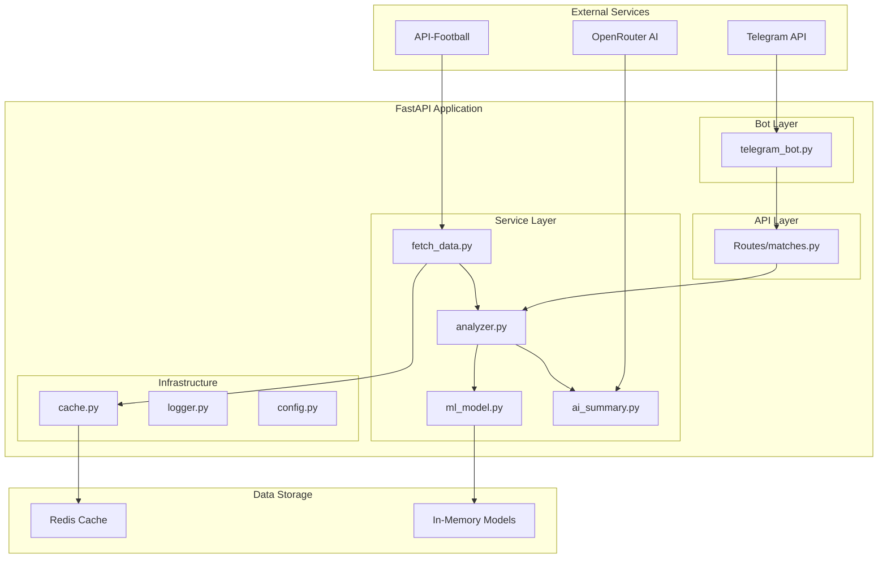

# Design Document

## Overview

The Football Match Predictor is a FastAPI-based system that integrates multiple external services to provide intelligent match predictions through a Telegram bot interface. The system follows a microservices-inspired architecture with clear separation of concerns, combining data collection, machine learning, AI-powered analysis, and user interaction components.

The system operates on a daily cycle, fetching match data, processing it through ML models, generating AI summaries, and serving predictions to users via Telegram bot interactions.

## Architecture

### High-Level Architecture



### Component Interaction Flow

1. **Data Collection**: `fetch_data.py` retrieves daily matches and team statistics from API-Football
2. **Feature Engineering**: `analyzer.py` processes raw data into ML-ready features
3. **Prediction Generation**: `ml_model.py` generates predictions using trained models
4. **AI Enhancement**: `ai_summary.py` creates human-readable explanations via OpenRouter
5. **User Interaction**: `telegram_bot.py` handles user requests and delivers predictions
6. **Caching**: `cache.py` optimizes performance by storing frequently accessed data

## Components and Interfaces

### Core Services

#### Data Fetching Service (`fetch_data.py`)
```python
class FootballDataFetcher:
    async def get_todays_matches() -> List[Match]
    async def get_team_stats(team_id: int) -> TeamStats
    async def get_recent_matches(team_id: int, limit: int = 5) -> List[Match]
    async def get_player_stats(team_id: int) -> List[PlayerStats]
```

**Responsibilities:**
- API-Football integration with rate limiting
- Data validation and transformation
- Error handling with exponential backoff
- Response caching to minimize API calls

#### ML Model Service (`ml_model.py`)
```python
class PredictionModels:
    def predict_score(features: MatchFeatures) -> ScorePrediction
    def predict_goal_scorer(team_stats: TeamStats, player_stats: List[PlayerStats]) -> PlayerPrediction
    def predict_yellow_cards(team_stats: TeamStats) -> CardPrediction
    def predict_corners(team_stats: TeamStats) -> CornerPrediction
    def predict_first_half(team_stats: TeamStats) -> FirstHalfPrediction
```

**Model Specifications:**
- **Score Prediction**: Logistic Regression with features (goal avg, conceded avg, home/away performance)
- **Goal Scorer**: Probability model based on recent goal contributions and playing time
- **Yellow Cards**: Poisson distribution based on team averages
- **Corners**: Linear regression on historical corner statistics
- **First Half**: Classification model using first-half specific statistics

#### Analysis Service (`analyzer.py`)
```python
class MatchAnalyzer:
    def extract_features(match: Match, team_stats: List[TeamStats]) -> MatchFeatures
    def calculate_team_metrics(recent_matches: List[Match]) -> TeamMetrics
    def generate_predictions(match: Match) -> MatchPredictions
```

**Feature Engineering:**
- Goal scoring rates (home/away split)
- Defensive performance metrics
- Player form indicators
- Head-to-head historical data
- Seasonal performance trends

#### AI Summary Service (`ai_summary.py`)
```python
class AISummaryGenerator:
    async def generate_match_summary(predictions: MatchPredictions, stats: MatchStats) -> str
    def format_prediction_explanation(prediction_type: str, data: dict) -> str
```

**OpenRouter Integration:**
- Model selection (Nous-Hermes, Llama 3, Mistral)
- Prompt engineering for football analysis
- Turkish language output formatting
- Fallback to statistical summaries

### Bot Interface

#### Telegram Bot (`telegram_bot.py`)
```python
class FootballPredictionBot:
    async def start_command(update: Update, context: ContextTypes.DEFAULT_TYPE)
    async def show_matches(update: Update, context: ContextTypes.DEFAULT_TYPE)
    async def handle_match_selection(update: Update, context: ContextTypes.DEFAULT_TYPE)
    async def send_predictions(chat_id: int, predictions: MatchPredictions)
```

**User Flow:**
1. `/start` → Welcome message + match list
2. Match selection → Trigger prediction pipeline
3. Prediction delivery → Formatted results with AI summary
4. Error handling → User-friendly error messages

### API Endpoints

#### Match Routes (`routes/matches.py`)
```python
@router.get("/matches/today")
async def get_todays_matches() -> List[Match]

@router.get("/matches/{match_id}/predictions")
async def get_match_predictions(match_id: int) -> MatchPredictions

@router.post("/matches/{match_id}/analyze")
async def analyze_match(match_id: int) -> AnalysisResult
```

## Data Models

### Core Data Structures (`models/schemas.py`)

```python
class Match(BaseModel):
    id: int
    home_team: Team
    away_team: Team
    kickoff_time: datetime
    league: str
    status: MatchStatus

class Team(BaseModel):
    id: int
    name: str
    logo_url: Optional[str]
    recent_form: List[MatchResult]

class TeamStats(BaseModel):
    team_id: int
    goals_scored_avg: float
    goals_conceded_avg: float
    yellow_cards_avg: float
    corners_avg: float
    home_performance: PerformanceMetrics
    away_performance: PerformanceMetrics

class PlayerStats(BaseModel):
    player_id: int
    name: str
    position: str
    goals_recent: int
    assists_recent: int
    minutes_played: int
    goal_probability: float

class MatchPredictions(BaseModel):
    match_id: int
    score_prediction: ScorePrediction
    goal_scorer_prediction: PlayerPrediction
    yellow_cards_prediction: CardPrediction
    corners_prediction: CornerPrediction
    first_half_prediction: FirstHalfPrediction
    ai_summary: str
    confidence_score: float

class MatchFeatures(BaseModel):
    home_goal_avg: float
    away_goal_avg: float
    home_conceded_avg: float
    away_conceded_avg: float
    home_advantage: float
    recent_form_diff: float
    head_to_head_ratio: float
```

## Error Handling

### API Integration Errors
- **Rate Limiting**: Implement exponential backoff with jitter
- **Network Failures**: Retry mechanism with circuit breaker pattern
- **Invalid Responses**: Data validation with Pydantic models
- **Authentication**: Secure API key management with rotation support

### ML Model Errors
- **Insufficient Data**: Fallback to league averages and historical data
- **Model Failures**: Default probability distributions for each prediction type
- **Feature Engineering**: Robust handling of missing or invalid statistics

### Bot Interaction Errors
- **Telegram API Failures**: Queue messages for retry
- **User Input Validation**: Clear error messages and guidance
- **Session Management**: Stateless design with context preservation

### System-Level Errors
- **Configuration**: Comprehensive environment variable validation
- **Logging**: Structured logging with correlation IDs
- **Monitoring**: Health check endpoints and error metrics

## Testing Strategy

### Unit Testing
- **Service Layer**: Mock external API responses for consistent testing
- **ML Models**: Test with synthetic data covering edge cases
- **Feature Engineering**: Validate calculations with known datasets
- **Bot Handlers**: Mock Telegram API interactions

### Integration Testing
- **API Endpoints**: Test complete request/response cycles
- **External Services**: Use test environments where available
- **Data Pipeline**: End-to-end testing with sample match data
- **Cache Integration**: Verify Redis operations and fallbacks

### Performance Testing
- **API Rate Limits**: Validate compliance with external service limits
- **Concurrent Users**: Test bot performance under load
- **Memory Usage**: Monitor ML model memory consumption
- **Response Times**: Ensure sub-second prediction generation

### Test Data Management
- **Mock Responses**: Comprehensive API-Football response fixtures
- **ML Training Data**: Historical match data for model validation
- **Bot Scenarios**: User interaction test cases
- **Error Scenarios**: Network failures, invalid data, API errors

## Configuration Management

### Environment Variables
```
# API Keys
API_FOOTBALL_KEY=your_api_key
TELEGRAM_BOT_TOKEN=your_bot_token
TELEGRAM_CHAT_ID=your_chat_id
OPENROUTER_API_KEY=your_openrouter_key
# Service Configuration
REDIS_URL=redis://localhost:6379
LOG_LEVEL=INFO
CACHE_TTL=3600

# ML Configuration
MODEL_CONFIDENCE_THRESHOLD=0.7
PREDICTION_CACHE_HOURS=6
```

### Deployment Configuration
- **Docker**: Multi-stage builds for production optimization
- **Health Checks**: Endpoint monitoring for service availability
- **Scaling**: Horizontal scaling support for bot handlers
- **Monitoring**: Integration with logging and metrics systems