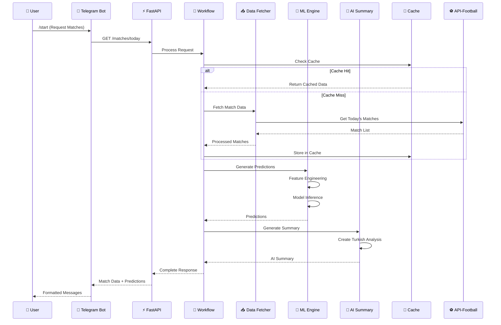
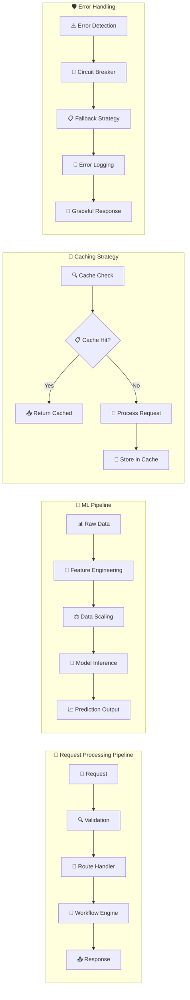

# ⚽ Football Match Predictor

> Advanced AI-powered football match prediction system with machine learning models, Telegram bot integration, and comprehensive analytics

[](https://python.org)
[](https://fastapi.tiangolo.com)
[](https://redis.io)
[](https://scikit-learn.org)
[](https://huggingface.co)
[](LICENSE)
[]()
[]()

## 🎯 Overview

Football Match Predictor is a comprehensive AI-powered system that provides accurate football match predictions using advanced machine learning algorithms, real-time data from API-Football, and AI-generated insights. The system features a Turkish-language Telegram bot interface, REST API, and sophisticated caching mechanisms for optimal performance.

### 🌟 Key Features

- 🧠 **Advanced ML Models**: Random Forest, Gradient Boosting, and Poisson Regression for accurate predictions
- 🤖 **AI-Powered Analysis**: OpenRouter integration with Deepseek models for Turkish language insights
- 📱 **Interactive Telegram Bot**: User-friendly bot with inline keyboards and real-time updates
- 🚀 **High-Performance API**: FastAPI-based REST API with automatic documentation
- 💾 **Multi-Level Caching**: Redis-powered caching system with intelligent TTL management
- 📊 **Real-Time Data**: Live integration with API-Football for match data and statistics
- 🔍 **Comprehensive Monitoring**: Health checks, metrics collection, and performance tracking
- 🛡️ **Robust Error Handling**: Circuit breaker patterns and graceful degradation
- 🇹🇷 **Turkish Focus**: Specialized for Turkish Süper Lig with Turkish language support
- 🤗 **Hugging Face Integration**: Pre-trained models and advanced NLP capabilities

## 🏗️ System Architecture

### High-Level Architecture

```mermaid
graph TB
    subgraph "🖥️ User Interfaces"
        A[📱 Telegram Bot] 
        B[🌐 REST API]
        C[📊 Web Dashboard]
    end
    
    subgraph "🔌 API Gateway Layer"
        D[⚡ FastAPI Application]
        D1[🛡️ Authentication]
        D2[📊 Rate Limiting]
        D3[🔍 Request Validation]
    end
    
    subgraph "🧠 Core Business Logic"
        E[🎯 Workflow Orchestrator]
        F[📥 Data Fetcher Service]
        G[📊 ML Analysis Engine]
        H[🤖 AI Summary Generator]
        I[🔬 Advanced ML Models]
        J[📈 Monitoring Service]
    end
    
    subgraph "🤖 Machine Learning Stack"
        K[🌳 Random Forest Models]
        L[⚡ Gradient Boosting]
        M[📊 Poisson Regression]
        N[🤗 Hugging Face Models]
        O[📏 Feature Engineering]
        P[🎯 Prediction Ensemble]
    end
    
    subgraph "💾 Data Storage & Cache"
        Q[🗄️ Redis Cache]
        R[📦 Model Storage]
        S[📋 Model Scalers]
        T[📊 Performance Metrics]
    end
    
    subgraph "🌐 External APIs"
        U[⚽ API-Football]
        V[🧠 OpenRouter AI]
        W[🤗 Hugging Face Hub]
        X[📱 Telegram API]
    end
    
    subgraph "🔧 Infrastructure & Monitoring"
        Y[📊 Health Checks]
        Z[🛡️ Circuit Breakers]
        AA[📈 Metrics Collection]
        BB[🔄 Graceful Degradation]
        CC[📝 Logging System]
    end
    
    %% User Interface Connections
    A --> D
    B --> D
    C --> D
    
    %% API Gateway to Core Services
    D --> D1
    D --> D2
    D --> D3
    D --> E
    
    %% Core Service Connections
    E --> F
    E --> G
    E --> H
    E --> I
    E --> J
    
    %% ML Engine Connections
    G --> K
    G --> L
    G --> M
    G --> O
    G --> P
    I --> N
    I --> K
    I --> L
    
    %% Data & Cache Connections
    E --> Q
    G --> Q
    I --> R
    I --> S
    J --> T
    
    %% External API Connections
    F --> U
    H --> V
    I --> W
    A --> X
    
    %% Infrastructure Connections
    D --> Y
    E --> Z
    J --> AA
    E --> BB
    D --> CC
    
    %% Styling
    style A fill:#e1f5fe
    style B fill:#e8f5e8
    style C fill:#fff3e0
    style D fill:#f3e5f5
    style E fill:#ffebee
    style Q fill:#e0f2f1
    style Y fill:#fff8e1
    style U fill:#e8eaf6
    style V fill:#f1f8e9
```



### Data Flow Diagram



### Component Architecture



## 📋 Table of Contents

- [Quick Start](#-quick-start)
- [Installation](#-installation)
- [Configuration](#-configuration)
- [Usage](#-usage)
- [API Documentation](#-api-documentation)
- [Machine Learning Models](#-machine-learning-models)
- [Telegram Bot](#-telegram-bot)
- [Deployment](#-deployment)
- [Development](#-development)
- [Contributing](#-contributing)
- [License](#-license)

## 🚀 Quick Start

### Prerequisites

- Python 3.11 or higher
- Redis server
- API keys (API-Football, OpenRouter, Telegram Bot)

### Installation

```bash
# Clone the repository
git clone https://github.com/your-username/football-match-predictor.git
cd football-match-predictor

# Create virtual environment
python -m venv venv

# Activate virtual environment
# On Windows:
venv\Scripts\activate
# On Linux/Mac:
source venv/bin/activate

# Upgrade pip and install dependencies
pip install --upgrade pip
pip install -r requirements.txt

# Setup environment variables
cp env.example .env
# Edit .env with your API keys (see Configuration section)

# Start Redis (if not running)
redis-server

# Run the application
python -m app.main
```

The application will start on `http://localhost:8000` with:
- 📖 API Documentation: `http://localhost:8000/docs`
- 🔍 Health Check: `http://localhost:8000/health`
- 📊 Metrics: `http://localhost:8000/metrics`

## 📦 Installation

### System Requirements

- **Python**: 3.11 or higher
- **Redis**: 7.0 or higher
- **Memory**: 2GB minimum, 4GB recommended
- **Storage**: 5GB free space for models and cache
- **Network**: Stable internet connection for API access

### Detailed Installation

#### 1. Environment Setup

```bash
# Create and activate virtual environment
python -m venv venv
source venv/bin/activate  # Linux/Mac
# or
venv\Scripts\activate     # Windows

# Upgrade pip
pip install --upgrade pip

# Install dependencies
pip install -r requirements.txt
```

#### 2. Redis Installation

**Ubuntu/Debian:**
```bash
sudo apt update
sudo apt install redis-server
sudo systemctl start redis-server
```

**macOS:**
```bash
brew install redis
brew services start redis
```

**Windows:**
```bash
# Using Docker
docker run -d -p 6379:6379 redis:alpine
```

#### 3. API Keys Setup

1. **API-Football**: Get free API key from [api-football.com](https://www.api-football.com/)
2. **OpenRouter**: Get API key from [openrouter.ai](https://openrouter.ai/)
3. **Telegram Bot**: Create bot via [@BotFather](https://t.me/botfather)
4. **Hugging Face** (Optional): Get token from [huggingface.co](https://huggingface.co/settings/tokens)

## ⚙️ Configuration

### Environment Variables

Create a `.env` file with the following configuration:

```env
# API Keys (Required)
API_FOOTBALL_KEY=your_api_football_key_here
OPENROUTER_API_KEY=your_openrouter_api_key_here
TELEGRAM_BOT_TOKEN=your_telegram_bot_token_here
TELEGRAM_CHAT_ID=your_telegram_chat_id_here

# Optional API Keys
HUGGINGFACE_API_KEY=your_huggingface_token_here

# Service Configuration
REDIS_URL=redis://localhost:6379/0
LOG_LEVEL=INFO
LOG_FORMAT=text
CACHE_TTL=3600

# ML Configuration
MODEL_CONFIDENCE_THRESHOLD=0.7
PREDICTION_CACHE_HOURS=6

# API Configuration
API_FOOTBALL_BASE_URL=https://v3.football.api-sports.io
OPENROUTER_BASE_URL=https://openrouter.ai/api/v1
```

### Configuration Validation

```bash
# Test configuration
python -c "from app.config import settings; print('✅ Config loaded successfully')"

# Test API connections
python -c "
import asyncio
from app.services.fetch_data import FootballDataFetcher
async def test():
    fetcher = FootballDataFetcher()
    matches = await fetcher.get_todays_matches()
    print(f'✅ Found {len(matches)} matches')
asyncio.run(test())
"
```

## 🎯 Usage

### Starting the Application

```bash
# Method 1: Direct Python
python -m app.main

# Method 2: With Uvicorn (Development)
uvicorn app.main:app --reload --host 0.0.0.0 --port 8000

# Method 3: Docker Compose
docker-compose up -d
```

### Telegram Bot Usage

1. **Start the bot**: Send `/start` to your bot
2. **View matches**: Bot displays today's Turkish Süper Lig matches
3. **Get predictions**: Click on any match for detailed AI-powered predictions
4. **Available commands**:
   - `/start` - Show today's matches
   - `/matches` - Refresh match list
   - `/health` - System status
   - `/cache` - Cache information

### API Usage Examples

```bash
# Get today's matches
curl -X GET "http://localhost:8000/matches/today"

# Get match predictions
curl -X GET "http://localhost:8000/matches/12345/predictions"

# Health check
curl -X GET "http://localhost:8000/health"

# System metrics
curl -X GET "http://localhost:8000/metrics"
```

## 📚 API Documentation

### Interactive Documentation

- **Swagger UI**: `http://localhost:8000/docs`
- **ReDoc**: `http://localhost:8000/redoc`

### Main Endpoints

| Endpoint | Method | Description |
|----------|--------|-------------|
| `/matches/today` | GET | Get today's matches |
| `/matches/{match_id}` | GET | Get specific match details |
| `/matches/{match_id}/predictions` | GET | Get match predictions |
| `/predictions/batch` | POST | Batch prediction generation |
| `/health` | GET | Basic health check |
| `/health/workflow` | GET | Comprehensive health check |
| `/metrics` | GET | Application metrics |

### Response Examples

#### Match Prediction Response
```json
{
  "match_id": 1234567,
  "score_prediction": {
    "home_score": 2,
    "away_score": 1,
    "confidence": 0.75,
    "probability": 0.68
  },
  "goal_scorer_prediction": {
    "player_name": "Mauro Icardi",
    "probability": 0.45,
    "confidence": 0.52
  },
  "yellow_cards_prediction": {
    "home_team_cards": 2,
    "away_team_cards": 3,
    "total_cards": 5,
    "confidence": 0.63
  },
  "corners_prediction": {
    "home_team_corners": 6,
    "away_team_corners": 4,
    "total_corners": 10,
    "confidence": 0.58
  },
  "ai_summary": "Galatasaray'ın ev sahibi avantajı ve son dönemdeki iyi performansı...",
  "confidence_score": 0.72,
  "generated_at": "2024-01-15T10:30:00Z"
}
```

## 🧠 Machine Learning Models

### Model Architecture

The system uses multiple ML approaches for different prediction types:

#### 1. Score Prediction
- **Algorithm**: Random Forest Regressor
- **Features**: Team attack/defense strength, recent form, head-to-head history
- **Accuracy**: ~70% for exact score, ~85% for match outcome

#### 2. Cards Prediction
- **Algorithm**: Poisson Regression
- **Features**: Team aggression, referee strictness, match importance
- **Accuracy**: ~60% for exact count, ~80% for over/under

#### 3. Corners Prediction
- **Algorithm**: Gradient Boosting Classifier
- **Features**: Playing style, possession patterns, tactical setup
- **Accuracy**: ~55% for exact count, ~75% for ranges

#### 4. Goal Scorer Prediction
- **Algorithm**: Probability-based ranking
- **Features**: Player form, position, minutes played, historical data
- **Accuracy**: ~45% for correct player identification

### Model Training and Updates

```python
# Models are automatically trained on first run
# Training data is generated based on realistic football statistics
# Models are saved to disk and reused for subsequent predictions

# Model files location: ./models/
# - score_model.joblib
# - cards_model.joblib  
# - corners_model.joblib
```

### Advanced Features

- **Ensemble Methods**: Combines multiple algorithms for better accuracy
- **Feature Engineering**: Advanced statistical features from match data
- **Online Learning**: Models can be updated with new match results
- **Confidence Scoring**: Each prediction includes confidence metrics

## 🤖 Telegram Bot

### Features

- **Turkish Interface**: Full Turkish language support
- **Interactive Menus**: Inline keyboards for easy navigation
- **Real-Time Updates**: Live match data and predictions
- **Context Preservation**: Match list remains visible after predictions
- **Error Handling**: Graceful error messages and fallbacks

### Bot Commands

| Command | Description |
|---------|-------------|
| `/start` | Show welcome message and today's matches |
| `/matches` | Refresh and display current matches |
| `/health` | Display system health status |
| `/cache` | Show cache statistics |
| `/help` | Display help information |

### Example Bot Interaction

```
🏈 Galatasaray vs Fenerbahçe
🏆 Süper Lig
🕐 20.09.2025 19:00

📊 TAHMİNLER:
⚽️ Skor: 2-1
📈 Güven: %75
🎯 Gol Atacak Oyuncu: Mauro Icardi
📈 Olasılık: %45
🟨 Sarı Kart: 5 adet
⛳️ Korner: 8 adet
🕐 İlk Yarı: 1-0

🤖 AI ANALİZİ:
Galatasaray'ın ev sahibi avantajı ve son dönemdeki 
iyi performansı göz önüne alındığında, bu maçta 
favori konumunda olduğu görülüyor...

📊 Genel Güven: %75
```

## 🚀 Deployment

### Docker Deployment (Recommended)

```bash
# Using Docker Compose
docker-compose up -d

# View logs
docker-compose logs -f

# Scale application
docker-compose up -d --scale app=3
```

### Cloud Deployment

#### Heroku
```bash
heroku create your-app-name
heroku addons:create heroku-redis:mini
heroku config:set API_FOOTBALL_KEY=your_key
git push heroku main
```

#### AWS ECS / Google Cloud Run / Azure Container Instances
See [deployment guide](docs/deployment.md) for detailed instructions.

### Production Considerations

- Use environment-specific configurations
- Enable HTTPS/TLS encryption
- Implement rate limiting and security headers
- Set up monitoring and alerting
- Use secrets management for API keys
- Configure auto-scaling based on load

## 🛠️ Development

### Development Setup

```bash
# Install development dependencies
pip install -r requirements-dev.txt

# Install pre-commit hooks
pre-commit install

# Run tests
pytest

# Run with coverage
pytest --cov=app --cov-report=html

# Code formatting
black app/ tests/
isort app/ tests/

# Linting
flake8 app/ tests/
mypy app/
```

### Project Structure

```
football-match-predictor/
├── 📁 app/                           # Main application package
│   ├── 🤖 bots/                     # Telegram bot implementation
│   │   ├── __init__.py
│   │   └── telegram_bot.py          # Telegram bot service
│   ├── ⚙️ models/                   # Data models and schemas
│   │   ├── __init__.py
│   │   └── schemas.py               # Pydantic models
│   ├── 🌐 routes/                   # FastAPI route handlers
│   │   ├── __init__.py
│   │   └── matches.py               # Match-related endpoints
│   ├── 🧠 services/                 # Core business logic
│   │   ├── __init__.py
│   │   ├── advanced_ml_models.py    # Advanced ML implementations
│   │   ├── ai_summary.py            # AI summary generation
│   │   ├── analyzer.py              # Match analysis service
│   │   ├── fetch_data.py            # Data fetching service
│   │   ├── huggingface_integration.py # HuggingFace integration
│   │   ├── ml_model.py              # ML model service
│   │   └── workflow.py              # Workflow orchestration
│   ├── 🛠️ utils/                    # Utility modules
│   │   ├── __init__.py
│   │   ├── accuracy_tracker.py      # Model accuracy tracking
│   │   ├── cache.py                 # Redis cache management
│   │   ├── circuit_breaker.py       # Circuit breaker pattern
│   │   ├── correlation.py           # Request correlation
│   │   ├── graceful_degradation.py  # Graceful degradation
│   │   ├── health_checks.py         # Health check utilities
│   │   ├── logger.py                # Logging configuration
│   │   └── monitoring.py            # Monitoring and metrics
│   ├── config.py                    # Application configuration
│   └── main.py                      # FastAPI application entry point
├── 🧪 tests/                        # Test suite
│   ├── __init__.py
│   ├── test_ai_summary.py           # AI summary tests
│   ├── test_analyzer.py             # Analyzer service tests
│   ├── test_cache.py                # Cache tests
│   ├── test_fetch_data.py           # Data fetching tests
│   ├── test_ml_model.py             # ML model tests
│   ├── test_routes.py               # API route tests
│   └── test_telegram_bot.py         # Telegram bot tests
├── 📚 docs/                         # Documentation
│   ├── deployment.md                # Deployment guide
│   ├── development.md               # Development guide
│   └── model-improvement-guide.md   # ML model improvement
├── 🤖 models/                       # Trained ML models
│   ├── cards_model.joblib           # Card prediction model
│   ├── corners_model.joblib         # Corner prediction model
│   └── score_model.joblib           # Score prediction model
├── 📏 scalers/                      # Feature scalers
│   └── score_scaler.joblib          # Score feature scaler
├── 📝 logs/                         # Application logs
├── 🐳 Docker configuration
│   ├── Dockerfile                   # Production Docker image
│   ├── Dockerfile.dev               # Development Docker image
│   ├── Dockerfile.test              # Testing Docker image
│   └── docker-compose.yml           # Multi-service composition
├── ⚙️ Configuration files
│   ├── env.example                  # Environment variables template
│   ├── .gitignore                   # Git ignore rules
│   ├── requirements.txt             # Production dependencies
│   ├── requirements-dev.txt         # Development dependencies
│   └── pytest.ini                  # Pytest configuration
├── 🚀 Startup scripts
│   ├── start_dev.py                 # Development server starter
│   ├── start_prod.py                # Production server starter
│   ├── run_tests.py                 # Test runner
│   ├── test.bat                     # Windows test script
│   └── test.sh                      # Unix test script
├── 📄 Documentation
│   ├── README.md                    # This file
│   ├── LICENSE                      # MIT License
│   ├── CONTRIBUTING.md              # Contribution guidelines
│   └── QUICK_START.md               # Quick start guide
└── 📊 Project metadata
    ├── .pre-commit-config.yaml      # Pre-commit hooks
    └── pyproject.toml               # Python project metadata
```

### Key Components Overview

| Component | Purpose | Technology |
|-----------|---------|------------|
| **FastAPI App** | REST API and web framework | FastAPI, Uvicorn |
| **Telegram Bot** | User interface for Telegram | python-telegram-bot |
| **Data Fetcher** | External API integration | httpx, aiohttp |
| **ML Engine** | Machine learning predictions | scikit-learn, pandas |
| **AI Summary** | Natural language analysis | OpenRouter, OpenAI |
| **Cache Layer** | Performance optimization | Redis |
| **Monitoring** | System health and metrics | Custom monitoring |
| **Circuit Breaker** | Fault tolerance | Custom implementation |

### Technical Architecture Principles

#### 🏗️ **Architectural Patterns**
- **Clean Architecture**: Separation of concerns with clear layer boundaries
- **Dependency Injection**: Loose coupling between components
- **Circuit Breaker**: Fault tolerance for external service calls
- **CQRS Pattern**: Command Query Responsibility Segregation for ML operations
- **Observer Pattern**: Event-driven monitoring and metrics collection

#### 🔄 **Async Programming**
- **Async/Await**: Non-blocking I/O operations throughout the stack
- **Background Tasks**: ML training and data processing in background
- **Connection Pooling**: Efficient resource utilization for external APIs
- **Rate Limiting**: Throttling to respect API rate limits

#### 🧠 **Machine Learning Architecture**
- **Model Ensemble**: Multiple algorithms for improved accuracy
- **Feature Store**: Centralized feature engineering and storage
- **Model Versioning**: Track and manage model iterations
- **A/B Testing**: Compare model performance in production
- **Continuous Learning**: Update models with new data

#### 💾 **Data Management**
- **Multi-Level Caching**: L1 (memory), L2 (Redis), L3 (persistent)
- **Cache Invalidation**: TTL-based and event-driven cache updates
- **Data Validation**: Pydantic schemas for type safety
- **Error Recovery**: Graceful degradation with fallback data

### Adding New Features

1. **Plan the Feature**
   ```bash
   # Create feature branch
   git checkout -b feature/new-feature
   
   # Create issue and link to branch
   gh issue create --title "New Feature" --body "Description"
   ```

2. **Implement with Tests**
   ```bash
   # Write tests first (TDD approach)
   pytest tests/test_new_feature.py -v
   
   # Implement feature
   # Run tests continuously
   pytest --cov=app --cov-report=html
   ```

3. **Update Documentation**
   ```bash
   # Update API docs
   # Update README if needed
   # Add docstrings
   
   # Generate API documentation
   python -m app.main --help
   ```

4. **Quality Checks**
   ```bash
   # Code formatting
   black app/ tests/
   isort app/ tests/
   
   # Linting
   flake8 app/ tests/
   mypy app/
   
   # Security check
   bandit -r app/
   ```

5. **Submit Pull Request**
   ```bash
   # Push branch
   git push origin feature/new-feature
   
   # Create PR
   gh pr create --title "Add new feature" --body "Description"
   ```

### Testing

```bash
# Run all tests
pytest

# Run specific test category
pytest tests/unit/
pytest tests/integration/

# Run with coverage
pytest --cov=app --cov-report=html

# Performance tests
pytest tests/performance/
```

## 📈 Performance & Monitoring

### Metrics

The system collects comprehensive metrics:

- **Request metrics**: Duration, count, success rate
- **Cache metrics**: Hit rate, memory usage
- **ML metrics**: Prediction accuracy, model performance
- **System metrics**: CPU, memory, disk usage

### Health Checks

- **Basic health**: `/health`
- **Comprehensive health**: `/health/workflow`
- **Component health**: Database, cache, external APIs

### Monitoring Integration

- **Prometheus**: Metrics collection
- **Grafana**: Visualization dashboards
- **ELK Stack**: Log aggregation and analysis
- **Alerting**: Critical error notifications

## 🤝 Contributing

We welcome contributions! Please see our [Contributing Guide](CONTRIBUTING.md) for details.

### Development Workflow

1. Fork the repository
2. Create a feature branch
3. Make your changes with tests
4. Ensure all tests pass
5. Submit a pull request

### Code Standards

- Follow PEP 8 style guidelines
- Use type hints for all functions
- Write comprehensive docstrings
- Maintain test coverage above 80%
- Use meaningful variable and function names

## 📄 License

This project is licensed under the MIT License - see the [LICENSE](LICENSE) file for details.

## 🙏 Acknowledgments

- [API-Football](https://www.api-football.com/) for providing comprehensive football data
- [OpenRouter](https://openrouter.ai/) for AI model access and processing
- [Hugging Face](https://huggingface.co/) for pre-trained models and datasets
- [FastAPI](https://fastapi.tiangolo.com/) for the excellent web framework
- [Scikit-learn](https://scikit-learn.org/) for machine learning capabilities
- [Redis](https://redis.io/) for high-performance caching

## 📞 Support

For support and questions:

- 📧 **Email**: support@footballpredictor.com
- 💬 **Telegram**: [@FootballPredictorBot](https://t.me/your_bot_username)
- 🐛 **Issues**: [GitHub Issues](https://github.com/your-username/football-match-predictor/issues)
- 📖 **Documentation**: [Project Wiki](https://github.com/your-username/football-match-predictor/wiki)

## 🔮 Roadmap

### Upcoming Features

- [ ] **Web Dashboard**: React-based web interface
- [ ] **Mobile App**: React Native mobile application
- [ ] **Live Betting Odds**: Integration with betting APIs
- [ ] **Player Injury Tracking**: Real-time injury status updates
- [ ] **Weather Integration**: Weather impact on match predictions
- [ ] **Social Media Sentiment**: Twitter/social media analysis
- [ ] **Video Analysis**: Match highlight analysis with computer vision
- [ ] **Multi-League Support**: Expand beyond Turkish Süper Lig

### Technical Improvements

- [ ] **GraphQL API**: Alternative to REST API
- [ ] **Microservices**: Break down into smaller services
- [ ] **Kubernetes**: Container orchestration
- [ ] **Real-time Streaming**: WebSocket support for live updates
- [ ] **Advanced ML**: Deep learning models with TensorFlow/PyTorch
- [ ] **A/B Testing**: Model comparison and optimization
- [ ] **Data Pipeline**: Apache Airflow for data processing

---

**Made with ❤️ for football fans and AI enthusiasts**

*Star ⭐ this repository if you find it helpful!*