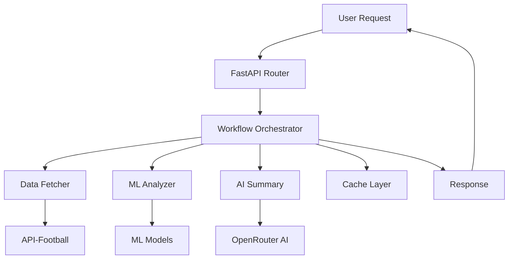

# 🛠️ Development Guide

This guide provides comprehensive information for developers who want to contribute to or extend the Football Match Predictor project.

## Table of Contents

- [Development Environment Setup](#development-environment-setup)
- [Project Structure](#project-structure)
- [Architecture Overview](#architecture-overview)
- [Development Workflow](#development-workflow)
- [Testing](#testing)
- [Code Quality](#code-quality)
- [Adding New Features](#adding-new-features)
- [Debugging](#debugging)
- [Performance Optimization](#performance-optimization)
- [Contributing Guidelines](#contributing-guidelines)

## Development Environment Setup

### Prerequisites

- **Python 3.11+**: Latest stable version recommended
- **Git**: For version control
- **Redis**: For caching (can use Docker)
- **IDE**: VS Code, PyCharm, or similar
- **API Keys**: API-Football, OpenRouter, Telegram Bot

### Initial Setup

```bash
# Clone the repository
git clone https://github.com/your-username/football-match-predictor.git
cd football-match-predictor

# Create virtual environment
python -m venv venv

# Activate virtual environment
# On Windows:
venv\Scripts\activate
# On macOS/Linux:
source venv/bin/activate

# Upgrade pip
pip install --upgrade pip

# Install development dependencies
pip install -r requirements-dev.txt

# Install pre-commit hooks
pre-commit install

# Copy environment template
cp .env.example .env
# Edit .env with your API keys and settings
```

### Development Dependencies

Create `requirements-dev.txt`:

```txt
# Production dependencies
-r requirements.txt

# Development tools
pytest>=7.4.0
pytest-cov>=4.1.0
pytest-asyncio>=0.21.0
pytest-mock>=3.11.0
black>=23.7.0
isort>=5.12.0
flake8>=6.0.0
mypy>=1.5.0
pre-commit>=3.3.0
bandit>=1.7.0
safety>=2.3.0

# Documentation
mkdocs>=1.5.0
mkdocs-material>=9.1.0
mkdocs-mermaid2-plugin>=1.1.0

# Debugging
ipdb>=0.13.0
memory-profiler>=0.61.0
line-profiler>=4.1.0
```

### IDE Configuration

#### VS Code Settings (.vscode/settings.json)

```json
{
    "python.defaultInterpreterPath": "./venv/bin/python",
    "python.linting.enabled": true,
    "python.linting.pylintEnabled": false,
    "python.linting.flake8Enabled": true,
    "python.linting.mypyEnabled": true,
    "python.formatting.provider": "black",
    "python.sortImports.args": ["--profile", "black"],
    "editor.formatOnSave": true,
    "editor.codeActionsOnSave": {
        "source.organizeImports": true
    },
    "python.testing.pytestEnabled": true,
    "python.testing.unittestEnabled": false,
    "python.testing.pytestArgs": [
        "tests"
    ],
    "files.exclude": {
        "**/__pycache__": true,
        "**/*.pyc": true,
        ".pytest_cache": true,
        ".coverage": true,
        "htmlcov": true
    }
}
```

#### VS Code Extensions

```json
{
    "recommendations": [
        "ms-python.python",
        "ms-python.black-formatter",
        "ms-python.isort",
        "ms-python.flake8",
        "ms-python.mypy-type-checker",
        "ms-vscode.vscode-json",
        "redhat.vscode-yaml",
        "ms-vscode.vscode-docker",
        "github.copilot"
    ]
}
```

## Project Structure

```
football-match-predictor/
├── app/                           # Main application package
│   ├── __init__.py
│   ├── main.py                    # FastAPI application entry point
│   ├── config.py                  # Configuration management
│   │
│   ├── bots/                      # Bot implementations
│   │   ├── __init__.py
│   │   └── telegram_bot.py        # Telegram bot
│   │
│   ├── models/                    # Data models and schemas
│   │   ├── __init__.py
│   │   └── schemas.py             # Pydantic models
│   │
│   ├── routes/                    # API route handlers
│   │   ├── __init__.py
│   │   ├── matches.py             # Match-related endpoints
│   │   └── health.py              # Health check endpoints
│   │
│   ├── services/                  # Business logic services
│   │   ├── __init__.py
│   │   ├── fetch_data.py          # Data fetching service
│   │   ├── analyzer.py            # ML analysis service
│   │   ├── ai_summary.py          # AI summary service
│   │   └── workflow.py            # Workflow orchestrator
│   │
│   └── utils/                     # Utility modules
│       ├── __init__.py
│       ├── cache.py               # Caching utilities
│       ├── logger.py              # Logging configuration
│       ├── correlation.py         # Request correlation
│       ├── monitoring.py          # Metrics and monitoring
│       ├── health_checks.py       # Health check utilities
│       ├── circuit_breaker.py     # Circuit breaker pattern
│       ├── graceful_degradation.py # Graceful degradation
│       └── accuracy_tracker.py    # Prediction accuracy tracking
│
├── tests/                         # Test suite
│   ├── __init__.py
│   ├── conftest.py               # Pytest configuration
│   ├── test_*.py                 # Test modules
│   ├── fixtures/                 # Test fixtures
│   └── integration/              # Integration tests
│
├── docs/                         # Documentation
│   ├── api.md                    # API documentation
│   ├── deployment.md             # Deployment guide
│   └── development.md            # This file
│
├── .kiro/                        # Kiro spec files
│   └── specs/
│       └── football-match-predictor/
│           ├── requirements.md
│           ├── design.md
│           └── tasks.md
│
├── .env.example                  # Environment template
├── .gitignore                    # Git ignore rules
├── .pre-commit-config.yaml       # Pre-commit configuration
├── docker-compose.yml            # Docker composition
├── Dockerfile                    # Docker image definition
├── requirements.txt              # Production dependencies
├── requirements-dev.txt          # Development dependencies
├── pytest.ini                   # Pytest configuration
├── pyproject.toml               # Project configuration
└── README.md                    # Project documentation
```

## Architecture Overview

### Core Components

#### 1. Workflow Orchestrator (`app/services/workflow.py`)

The central component that coordinates all prediction workflows:

```python
class WorkflowOrchestrator:
    """Orchestrates the complete prediction workflow."""
    
    async def generate_prediction(self, match_id: int) -> MatchPredictions:
        """Generate comprehensive match predictions."""
        # 1. Fetch match data
        # 2. Run ML analysis
        # 3. Generate AI summary
        # 4. Combine results
        # 5. Cache predictions
```

#### 2. Data Fetcher (`app/services/fetch_data.py`)

Handles all external API interactions:

```python
class FootballDataFetcher:
    """Fetches data from API-Football with caching and error handling."""
    
    async def get_todays_matches(self) -> List[Match]:
        """Get today's matches with Turkish league priority."""
        
    async def get_match_details(self, match_id: int) -> MatchDetails:
        """Get detailed match information."""
```

#### 3. ML Analyzer (`app/services/analyzer.py`)

Provides machine learning predictions:

```python
class MLAnalyzer:
    """Machine learning analysis for match predictions."""
    
    async def predict_score(self, match_data: MatchData) -> ScorePrediction:
        """Predict match score using ML models."""
        
    async def predict_goal_scorer(self, match_data: MatchData) -> PlayerPrediction:
        """Predict most likely goal scorer."""
```

#### 4. AI Summary (`app/services/ai_summary.py`)

Generates human-readable analysis:

```python
class AISummaryService:
    """AI-powered match analysis and summary generation."""
    
    async def generate_summary(self, predictions: dict, match: Match) -> str:
        """Generate Turkish language match analysis."""
```

### Data Flow



### Design Patterns Used

1. **Repository Pattern**: Data access abstraction
2. **Service Layer**: Business logic separation
3. **Circuit Breaker**: Fault tolerance
4. **Observer Pattern**: Event handling
5. **Strategy Pattern**: Multiple prediction algorithms
6. **Factory Pattern**: Service instantiation
7. **Decorator Pattern**: Caching and monitoring

## Development Workflow

### Git Workflow

We use Git Flow with the following branches:

- `main`: Production-ready code
- `develop`: Integration branch for features
- `feature/*`: Feature development branches
- `hotfix/*`: Critical bug fixes
- `release/*`: Release preparation

#### Creating a Feature

```bash
# Start from develop branch
git checkout develop
git pull origin develop

# Create feature branch
git checkout -b feature/new-prediction-model

# Make changes and commit
git add .
git commit -m "feat: add new prediction model for corners"

# Push feature branch
git push origin feature/new-prediction-model

# Create pull request to develop
```

#### Commit Message Convention

We follow [Conventional Commits](https://www.conventionalcommits.org/):

```
<type>[optional scope]: <description>

[optional body]

[optional footer(s)]
```

Types:
- `feat`: New feature
- `fix`: Bug fix
- `docs`: Documentation changes
- `style`: Code style changes
- `refactor`: Code refactoring
- `test`: Adding tests
- `chore`: Maintenance tasks

Examples:
```
feat(analyzer): add corner prediction model
fix(cache): resolve Redis connection timeout
docs(api): update endpoint documentation
test(workflow): add integration tests for prediction flow
```

### Code Review Process

1. **Create Pull Request**: Include description, testing notes
2. **Automated Checks**: CI/CD pipeline runs tests and linting
3. **Peer Review**: At least one team member reviews
4. **Address Feedback**: Make requested changes
5. **Merge**: Squash and merge to target branch

### Release Process

```bash
# Create release branch
git checkout -b release/v1.2.0 develop

# Update version numbers
# Update CHANGELOG.md
# Final testing

# Merge to main
git checkout main
git merge --no-ff release/v1.2.0

# Tag release
git tag -a v1.2.0 -m "Release version 1.2.0"

# Merge back to develop
git checkout develop
git merge --no-ff release/v1.2.0

# Push everything
git push origin main develop --tags
```

## Testing

### Test Structure

```
tests/
├── conftest.py                   # Shared fixtures
├── unit/                         # Unit tests
│   ├── test_analyzer.py
│   ├── test_cache.py
│   └── test_workflow.py
├── integration/                  # Integration tests
│   ├── test_api_endpoints.py
│   └── test_telegram_bot.py
├── fixtures/                     # Test data
│   ├── match_data.json
│   └── prediction_responses.json
└── performance/                  # Performance tests
    └── test_load.py
```

### Writing Tests

#### Unit Test Example

```python
# tests/unit/test_analyzer.py
import pytest
from unittest.mock import AsyncMock, patch
from app.services.analyzer import MLAnalyzer
from app.models.schemas import MatchData, ScorePrediction

class TestMLAnalyzer:
    @pytest.fixture
    def analyzer(self):
        return MLAnalyzer()
    
    @pytest.fixture
    def sample_match_data(self):
        return MatchData(
            home_team_id=123,
            away_team_id=456,
            league_id=203,
            # ... other fields
        )
    
    @pytest.mark.asyncio
    async def test_predict_score_success(self, analyzer, sample_match_data):
        """Test successful score prediction."""
        prediction = await analyzer.predict_score(sample_match_data)
        
        assert isinstance(prediction, ScorePrediction)
        assert prediction.home_score >= 0
        assert prediction.away_score >= 0
        assert 0 <= prediction.confidence <= 1
    
    @pytest.mark.asyncio
    async def test_predict_score_with_invalid_data(self, analyzer):
        """Test score prediction with invalid data."""
        invalid_data = MatchData(home_team_id=-1, away_team_id=-1)
        
        with pytest.raises(ValueError):
            await analyzer.predict_score(invalid_data)
```

#### Integration Test Example

```python
# tests/integration/test_api_endpoints.py
import pytest
from httpx import AsyncClient
from app.main import app

class TestMatchEndpoints:
    @pytest.mark.asyncio
    async def test_get_todays_matches(self):
        """Test getting today's matches."""
        async with AsyncClient(app=app, base_url="http://test") as client:
            response = await client.get("/matches/today")
            
        assert response.status_code == 200
        data = response.json()
        assert isinstance(data, list)
        
        if data:  # If matches exist
            match = data[0]
            assert "id" in match
            assert "home_team" in match
            assert "away_team" in match
    
    @pytest.mark.asyncio
    async def test_get_match_predictions(self):
        """Test getting match predictions."""
        # First get a match ID
        async with AsyncClient(app=app, base_url="http://test") as client:
            matches_response = await client.get("/matches/today")
            matches = matches_response.json()
            
            if not matches:
                pytest.skip("No matches available for testing")
            
            match_id = matches[0]["id"]
            
            # Get predictions
            pred_response = await client.get(f"/matches/{match_id}/predictions")
            
        assert pred_response.status_code == 200
        prediction = pred_response.json()
        assert "match_id" in prediction
        assert "score_prediction" in prediction
        assert "confidence_score" in prediction
```

### Test Configuration

#### pytest.ini

```ini
[tool:pytest]
testpaths = tests
python_files = test_*.py
python_classes = Test*
python_functions = test_*
addopts = 
    --strict-markers
    --strict-config
    --verbose
    --tb=short
    --cov=app
    --cov-report=term-missing
    --cov-report=html
    --cov-fail-under=80
asyncio_mode = auto
markers =
    slow: marks tests as slow (deselect with '-m "not slow"')
    integration: marks tests as integration tests
    unit: marks tests as unit tests
    performance: marks tests as performance tests
```

#### conftest.py

```python
# tests/conftest.py
import pytest
import asyncio
from unittest.mock import AsyncMock
from app.config import get_settings
from app.utils.cache import CacheManager

@pytest.fixture(scope="session")
def event_loop():
    """Create an instance of the default event loop for the test session."""
    loop = asyncio.get_event_loop_policy().new_event_loop()
    yield loop
    loop.close()

@pytest.fixture
def mock_settings():
    """Mock settings for testing."""
    settings = get_settings()
    settings.ENVIRONMENT = "test"
    settings.CACHE_TTL = 60
    settings.LOG_LEVEL = "DEBUG"
    return settings

@pytest.fixture
async def cache_manager():
    """Provide a cache manager for testing."""
    cache = CacheManager()
    await cache.clear_all()  # Start with clean cache
    yield cache
    await cache.clear_all()  # Clean up after test

@pytest.fixture
def mock_api_response():
    """Mock API response data."""
    return {
        "response": [
            {
                "fixture": {
                    "id": 12345,
                    "date": "2024-01-15T19:00:00+00:00",
                    "status": {"short": "NS"}
                },
                "teams": {
                    "home": {"id": 123, "name": "Galatasaray"},
                    "away": {"id": 456, "name": "Fenerbahçe"}
                },
                "league": {"id": 203, "name": "Süper Lig"}
            }
        ]
    }
```

### Running Tests

```bash
# Run all tests
pytest

# Run specific test file
pytest tests/unit/test_analyzer.py

# Run with coverage
pytest --cov=app --cov-report=html

# Run only unit tests
pytest -m unit

# Run tests in parallel
pytest -n auto

# Run with verbose output
pytest -v

# Run specific test
pytest tests/unit/test_analyzer.py::TestMLAnalyzer::test_predict_score_success
```

## Code Quality

### Linting and Formatting

#### Black (Code Formatting)

```bash
# Format all code
black app/ tests/

# Check formatting
black --check app/ tests/

# Format specific file
black app/services/workflow.py
```

#### isort (Import Sorting)

```bash
# Sort imports
isort app/ tests/

# Check import sorting
isort --check-only app/ tests/
```

#### Flake8 (Linting)

```bash
# Lint code
flake8 app/ tests/

# Lint with specific config
flake8 --config=.flake8 app/
```

Configuration in `.flake8`:

```ini
[flake8]
max-line-length = 88
extend-ignore = E203, W503, E501
exclude = 
    .git,
    __pycache__,
    venv,
    .venv,
    build,
    dist
per-file-ignores =
    __init__.py:F401
```

#### MyPy (Type Checking)

```bash
# Type check
mypy app/

# Type check with config
mypy --config-file=pyproject.toml app/
```

Configuration in `pyproject.toml`:

```toml
[tool.mypy]
python_version = "3.11"
warn_return_any = true
warn_unused_configs = true
disallow_untyped_defs = true
disallow_incomplete_defs = true
check_untyped_defs = true
disallow_untyped_decorators = true
no_implicit_optional = true
warn_redundant_casts = true
warn_unused_ignores = true
warn_no_return = true
warn_unreachable = true
strict_equality = true

[[tool.mypy.overrides]]
module = "tests.*"
disallow_untyped_defs = false
```

### Pre-commit Hooks

Configuration in `.pre-commit-config.yaml`:

```yaml
repos:
  - repo: https://github.com/pre-commit/pre-commit-hooks
    rev: v4.4.0
    hooks:
      - id: trailing-whitespace
      - id: end-of-file-fixer
      - id: check-yaml
      - id: check-added-large-files
      - id: check-merge-conflict
  
  - repo: https://github.com/psf/black
    rev: 23.7.0
    hooks:
      - id: black
        language_version: python3.11
  
  - repo: https://github.com/pycqa/isort
    rev: 5.12.0
    hooks:
      - id: isort
        args: ["--profile", "black"]
  
  - repo: https://github.com/pycqa/flake8
    rev: 6.0.0
    hooks:
      - id: flake8
  
  - repo: https://github.com/pre-commit/mirrors-mypy
    rev: v1.5.0
    hooks:
      - id: mypy
        additional_dependencies: [types-redis, types-requests]
```

### Security Scanning

#### Bandit (Security Issues)

```bash
# Scan for security issues
bandit -r app/

# Generate report
bandit -r app/ -f json -o security-report.json
```

#### Safety (Dependency Vulnerabilities)

```bash
# Check dependencies for vulnerabilities
safety check

# Check requirements file
safety check -r requirements.txt
```

## Adding New Features

### Feature Development Process

1. **Plan the Feature**
   - Define requirements clearly
   - Design the API/interface
   - Consider impact on existing code
   - Plan testing strategy

2. **Create Feature Branch**
   ```bash
   git checkout -b feature/new-feature-name
   ```

3. **Implement Core Logic**
   - Start with service layer
   - Add data models if needed
   - Implement business logic
   - Add error handling

4. **Add API Endpoints**
   - Create route handlers
   - Add request/response models
   - Implement validation
   - Add documentation

5. **Write Tests**
   - Unit tests for core logic
   - Integration tests for API
   - Mock external dependencies
   - Test error scenarios

6. **Update Documentation**
   - API documentation
   - Code comments
   - README updates
   - Architecture diagrams

### Example: Adding a New Prediction Model

#### 1. Define the Model Interface

```python
# app/models/schemas.py
from pydantic import BaseModel
from typing import Optional

class CornersPrediction(BaseModel):
    """Prediction for corner kicks in a match."""
    home_team_corners: int
    away_team_corners: int
    total_corners: int
    confidence: float
    probability_over_9: float
    probability_under_9: float
```

#### 2. Implement the Service

```python
# app/services/corners_predictor.py
from typing import Dict, Any
import numpy as np
from app.models.schemas import CornersPrediction, MatchData
from app.utils.logger import get_logger

logger = get_logger(__name__)

class CornersPredictor:
    """Predicts corner kicks for football matches."""
    
    def __init__(self):
        self.model_weights = {
            'home_advantage': 0.15,
            'recent_form': 0.25,
            'head_to_head': 0.20,
            'league_average': 0.40
        }
    
    async def predict_corners(self, match_data: MatchData) -> CornersPrediction:
        """Predict corner kicks for a match."""
        try:
            # Calculate features
            features = await self._extract_features(match_data)
            
            # Make prediction
            home_corners = self._predict_team_corners(features, 'home')
            away_corners = self._predict_team_corners(features, 'away')
            total_corners = home_corners + away_corners
            
            # Calculate confidence
            confidence = self._calculate_confidence(features)
            
            # Calculate probabilities
            prob_over_9 = self._calculate_probability_over(total_corners, 9)
            prob_under_9 = 1 - prob_over_9
            
            return CornersPrediction(
                home_team_corners=home_corners,
                away_team_corners=away_corners,
                total_corners=total_corners,
                confidence=confidence,
                probability_over_9=prob_over_9,
                probability_under_9=prob_under_9
            )
            
        except Exception as e:
            logger.error(f"Error predicting corners: {e}")
            raise
    
    async def _extract_features(self, match_data: MatchData) -> Dict[str, Any]:
        """Extract features for corner prediction."""
        # Implementation details...
        pass
    
    def _predict_team_corners(self, features: Dict[str, Any], team: str) -> int:
        """Predict corners for a specific team."""
        # Implementation details...
        pass
    
    def _calculate_confidence(self, features: Dict[str, Any]) -> float:
        """Calculate prediction confidence."""
        # Implementation details...
        pass
    
    def _calculate_probability_over(self, predicted_total: int, threshold: int) -> float:
        """Calculate probability of total being over threshold."""
        # Implementation details...
        pass
```

#### 3. Integrate with Workflow

```python
# app/services/workflow.py (updated)
from app.services.corners_predictor import CornersPredictor

class WorkflowOrchestrator:
    def __init__(self):
        # ... existing code ...
        self.corners_predictor = CornersPredictor()
    
    async def generate_prediction(self, match_id: int) -> MatchPredictions:
        """Generate comprehensive match predictions."""
        # ... existing code ...
        
        # Add corners prediction
        corners_prediction = await self.corners_predictor.predict_corners(match_data)
        
        # ... combine with other predictions ...
```

#### 4. Add API Endpoint

```python
# app/routes/matches.py (updated)
@router.get("/{match_id}/corners", response_model=CornersPrediction)
async def get_corners_prediction(
    match_id: int,
    workflow: WorkflowOrchestrator = Depends(get_workflow_orchestrator)
):
    """Get corners prediction for a specific match."""
    try:
        prediction = await workflow.predict_corners(match_id)
        return prediction
    except Exception as e:
        logger.error(f"Error getting corners prediction: {e}")
        raise HTTPException(status_code=500, detail="Prediction failed")
```

#### 5. Write Tests

```python
# tests/unit/test_corners_predictor.py
import pytest
from app.services.corners_predictor import CornersPredictor
from app.models.schemas import MatchData, CornersPrediction

class TestCornersPredictor:
    @pytest.fixture
    def predictor(self):
        return CornersPredictor()
    
    @pytest.fixture
    def sample_match_data(self):
        return MatchData(
            home_team_id=123,
            away_team_id=456,
            league_id=203
        )
    
    @pytest.mark.asyncio
    async def test_predict_corners_success(self, predictor, sample_match_data):
        """Test successful corners prediction."""
        prediction = await predictor.predict_corners(sample_match_data)
        
        assert isinstance(prediction, CornersPrediction)
        assert prediction.home_team_corners >= 0
        assert prediction.away_team_corners >= 0
        assert prediction.total_corners >= 0
        assert 0 <= prediction.confidence <= 1
        assert 0 <= prediction.probability_over_9 <= 1
        assert 0 <= prediction.probability_under_9 <= 1
        
        # Probabilities should sum to 1
        assert abs(prediction.probability_over_9 + prediction.probability_under_9 - 1) < 0.01
```

## Debugging

### Logging

#### Configuration

```python
# app/utils/logger.py
import logging
import sys
from typing import Optional
from app.config import get_settings

def setup_logging(level: Optional[str] = None) -> None:
    """Setup application logging."""
    settings = get_settings()
    log_level = level or settings.LOG_LEVEL
    
    # Configure root logger
    logging.basicConfig(
        level=getattr(logging, log_level.upper()),
        format='%(asctime)s - %(name)s - %(levelname)s - [%(correlation_id)s] - %(message)s',
        handlers=[
            logging.StreamHandler(sys.stdout),
            logging.FileHandler('logs/app.log')
        ]
    )
    
    # Configure specific loggers
    logging.getLogger('httpx').setLevel(logging.WARNING)
    logging.getLogger('redis').setLevel(logging.INFO)

def get_logger(name: str) -> logging.Logger:
    """Get a logger instance."""
    return logging.getLogger(name)
```

#### Usage

```python
from app.utils.logger import get_logger

logger = get_logger(__name__)

async def some_function():
    logger.info("Starting function execution")
    
    try:
        result = await some_operation()
        logger.info(f"Operation completed successfully: {result}")
        return result
    except Exception as e:
        logger.error(f"Operation failed: {e}", exc_info=True)
        raise
```

### Debugging Tools

#### IPython Debugger

```python
# Add breakpoint in code
import ipdb; ipdb.set_trace()

# Or use built-in breakpoint (Python 3.7+)
breakpoint()
```

#### Memory Profiling

```python
# app/utils/profiling.py
from memory_profiler import profile
from functools import wraps

def memory_profile(func):
    """Decorator to profile memory usage."""
    @wraps(func)
    @profile
    def wrapper(*args, **kwargs):
        return func(*args, **kwargs)
    return wrapper

# Usage
@memory_profile
async def memory_intensive_function():
    # Function implementation
    pass
```

#### Performance Profiling

```python
import cProfile
import pstats
from functools import wraps

def performance_profile(func):
    """Decorator to profile function performance."""
    @wraps(func)
    def wrapper(*args, **kwargs):
        profiler = cProfile.Profile()
        profiler.enable()
        
        try:
            result = func(*args, **kwargs)
            return result
        finally:
            profiler.disable()
            stats = pstats.Stats(profiler)
            stats.sort_stats('cumulative')
            stats.print_stats(20)  # Top 20 functions
    
    return wrapper
```

### Common Debugging Scenarios

#### Redis Connection Issues

```python
async def debug_redis_connection():
    """Debug Redis connection issues."""
    from app.utils.cache import CacheManager
    
    cache = CacheManager()
    
    try:
        # Test basic connection
        await cache.ping()
        print("✅ Redis connection successful")
        
        # Test set/get operations
        await cache.set("test_key", "test_value", ttl=60)
        value = await cache.get("test_key")
        print(f"✅ Cache operations successful: {value}")
        
        # Test cache info
        info = await cache.get_info()
        print(f"✅ Redis info: {info}")
        
    except Exception as e:
        print(f"❌ Redis connection failed: {e}")
        import traceback
        traceback.print_exc()
```

#### API Rate Limiting Issues

```python
async def debug_api_rate_limits():
    """Debug API rate limiting issues."""
    from app.services.fetch_data import FootballDataFetcher
    
    fetcher = FootballDataFetcher()
    
    try:
        # Check API status
        status = await fetcher.get_api_status()
        print(f"API Status: {status}")
        
        # Check rate limits
        limits = await fetcher.get_rate_limits()
        print(f"Rate Limits: {limits}")
        
        # Test API call
        matches = await fetcher.get_todays_matches()
        print(f"✅ API call successful: {len(matches)} matches")
        
    except Exception as e:
        print(f"❌ API call failed: {e}")
        import traceback
        traceback.print_exc()
```

## Performance Optimization

### Profiling

#### Application Profiling

```bash
# Profile the application
python -m cProfile -o profile.stats -m app.main

# Analyze profile results
python -c "
import pstats
p = pstats.Stats('profile.stats')
p.sort_stats('cumulative').print_stats(20)
"
```

#### Memory Profiling

```bash
# Install memory profiler
pip install memory-profiler

# Profile memory usage
python -m memory_profiler app/main.py

# Line-by-line memory profiling
kernprof -l -v app/services/workflow.py
```

### Optimization Techniques

#### Async Optimization

```python
import asyncio
from typing import List

async def optimized_batch_processing(items: List[Any]) -> List[Any]:
    """Process items in batches with concurrency control."""
    semaphore = asyncio.Semaphore(10)  # Limit concurrent operations
    
    async def process_item(item):
        async with semaphore:
            return await expensive_operation(item)
    
    # Process in batches
    batch_size = 50
    results = []
    
    for i in range(0, len(items), batch_size):
        batch = items[i:i + batch_size]
        batch_results = await asyncio.gather(
            *[process_item(item) for item in batch],
            return_exceptions=True
        )
        results.extend(batch_results)
    
    return results
```

#### Caching Optimization

```python
from functools import lru_cache
from app.utils.cache import CacheManager

class OptimizedService:
    def __init__(self):
        self.cache = CacheManager()
    
    @lru_cache(maxsize=1000)
    def expensive_calculation(self, param: str) -> float:
        """CPU-intensive calculation with memory cache."""
        # Expensive computation
        return result
    
    async def cached_api_call(self, key: str) -> dict:
        """API call with Redis cache."""
        # Try cache first
        cached = await self.cache.get(f"api:{key}")
        if cached:
            return cached
        
        # Make API call
        result = await self.api_call(key)
        
        # Cache result
        await self.cache.set(f"api:{key}", result, ttl=3600)
        
        return result
```

#### Database Query Optimization

```python
async def optimized_data_fetching(match_ids: List[int]) -> List[dict]:
    """Fetch data efficiently with batching and caching."""
    # Check cache for all IDs
    cache_keys = [f"match:{mid}" for mid in match_ids]
    cached_results = await cache.get_many(cache_keys)
    
    # Identify missing data
    missing_ids = [
        match_ids[i] for i, result in enumerate(cached_results)
        if result is None
    ]
    
    # Fetch missing data in batch
    if missing_ids:
        fresh_data = await api.get_matches_batch(missing_ids)
        
        # Cache fresh data
        cache_data = {
            f"match:{data['id']}": data
            for data in fresh_data
        }
        await cache.set_many(cache_data, ttl=3600)
        
        # Merge results
        for i, match_id in enumerate(match_ids):
            if cached_results[i] is None:
                cached_results[i] = next(
                    data for data in fresh_data
                    if data['id'] == match_id
                )
    
    return cached_results
```

## Contributing Guidelines

### Code Standards

1. **Follow PEP 8**: Use Black for formatting
2. **Type Hints**: Add type hints to all functions
3. **Docstrings**: Use Google-style docstrings
4. **Error Handling**: Handle exceptions appropriately
5. **Logging**: Add appropriate logging statements
6. **Testing**: Maintain >80% test coverage

### Documentation Standards

1. **API Documentation**: Update OpenAPI specs
2. **Code Comments**: Explain complex logic
3. **README Updates**: Keep documentation current
4. **Architecture Diagrams**: Update when structure changes

### Pull Request Guidelines

1. **Clear Description**: Explain what and why
2. **Small Changes**: Keep PRs focused and small
3. **Tests Included**: Add tests for new functionality
4. **Documentation Updated**: Update relevant docs
5. **No Breaking Changes**: Avoid breaking existing APIs

### Code Review Checklist

- [ ] Code follows style guidelines
- [ ] All tests pass
- [ ] New functionality is tested
- [ ] Documentation is updated
- [ ] No security vulnerabilities
- [ ] Performance impact considered
- [ ] Error handling is appropriate
- [ ] Logging is adequate

---

*This development guide should help you get started with contributing to the Football Match Predictor project. For specific questions, please refer to the team or create an issue in the repository.*